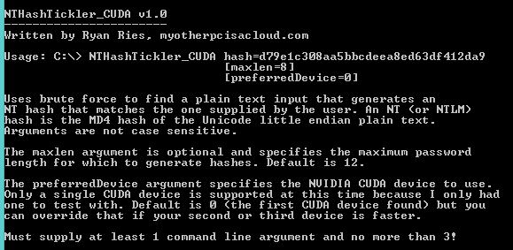
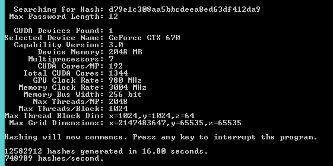

NTHashTickler_CUDA
==================

This is my NTHashTickler program ported to NVIDIA CUDA. It requires a 64-bit processor and a fairly modern Nvidia graphics card in order to run.

It currently is still in beta phase, and it's slower than my CPU version at this point. So it still needs a lot of work.

I didn't write this because I'm really interested in cracking NT hashes - I'm just writing this to teach myself CUDA.

